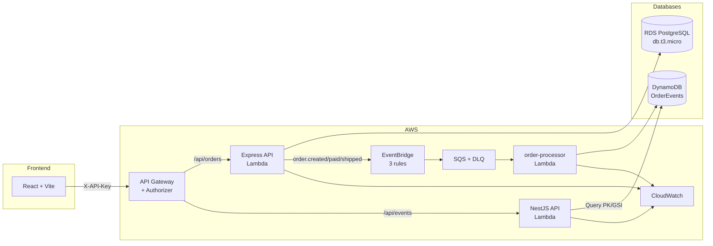

# project-instruction

A hands-on, end-to-end guide for building a full-stack event-driven system. Follow the steps in order — each builds on the previous.

> **Start with Step 0** — it describes the full system before you write any code.

---

## Repository layout

| Repository | What lives here |
|---|---|
| `my-app-frontend` | React + Vite — Orders table with action buttons, Events timeline |
| `my-app-express-api` | Express REST API — orders, status machine (pending→paid→shipped), PostgreSQL |
| `my-app-nest-api` | NestJS API — events read API, DynamoDB, hexagonal architecture |
| `my-app-cdk-recipes` | Shared CDK L3 Constructs — npm library consumed by `my-app-infra` |
| `my-app-infra` | AWS CDK infrastructure — multi-stack |
| `my-app-lambda` | Lambda function — order-processor (3 event types, PK/SK writes) |

Create all six as **private** GitHub repositories before you start.

---

## Architecture

> **💰 Free Tier eligible** — Lambda, DynamoDB, SQS, EventBridge, API Gateway, S3, CloudFront (always free or free 12 months). RDS db.t3.micro free for 12 months.

---

## Steps

| # | Guide | What you will build |
|---|-------|---------------------|
| 0 | [**Project Overview**](docs/step-00-overview.md) | Full system blueprint — read before writing any code |
| 1 | [Prerequisites](docs/step-01-prerequisites.md) | Install tools, AWS account, create six GitHub repos |
| 2 | [Frontend](docs/step-02-frontend.md) | React + Vite, React Query, TanStack Table, action buttons |
| 3 | [Express API](docs/step-03-express-api.md) | REST API, Zod, Prisma, PostgreSQL, Swagger, PATCH pay/ship endpoints |
| 4 | [Local Environment](docs/step-04-docker-local-env.md) | Docker Compose — all services with one command |
| 5 | [NestJS API](docs/step-05-nest-api.md) | Hexagonal architecture, DynamoDB QueryCommand, Swagger |
| 6 | [CloudWatch Observability](docs/step-14-cloudwatch.md) | Structured logging (Pino), CDK log groups + retention, Lambda alarm |
| 7 | [GitHub Actions CI/CD](docs/step-07-github-actions.md) | Per-repo CI: build, test, Docker image on every push |
| 8 | [CDK Recipes](docs/step-08-cdk-recipes.md) | `LambdaApiService` L3 Construct library — git dep → GitHub Packages |
| 9 | [AWS CDK Infrastructure](docs/step-09-aws-cdk-infra.md) | Multi-stack CDK project consuming the recipe |
| 10 | [DynamoDB](docs/step-10-dynamodb.md) | Single-table design: PK=ORDER#id, SK=EVENT#type#ts, GSI |
| 11 | [SQS](docs/step-11-sqs.md) | Queue + DLQ for reliable async messaging |
| 12 | [EventBridge](docs/step-12-eventbridge.md) | 3 rules (order.created / paid / shipped) → SQS |
| 13 | [Lambda](docs/step-13-lambda.md) | Handler for 3 event types, PK/SK writes, verified with Query |
| 14 | [CloudWatch (AWS setup)](docs/step-14-cloudwatch.md) | Console navigation, Logs Insights, SNS alarm |
| 15 | [API Gateway](docs/step-15-api-gateway.md) | HTTP API proxy + Lambda Authorizer (X-API-Key, SSM) |
