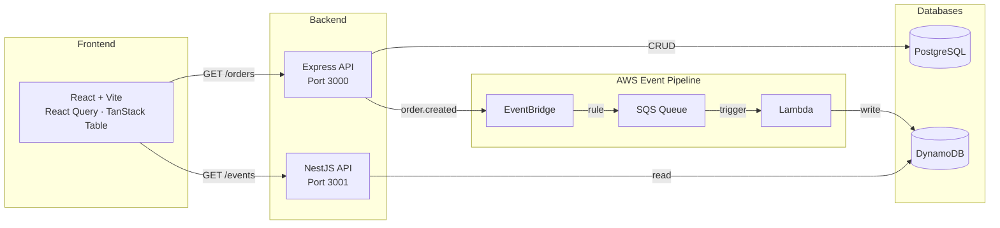

# project-instruction

A hands-on, end-to-end learning guide for building a full-stack event-driven system from scratch. Each step is a standalone guide that progressively builds on the previous one — start small, finish with a production-like architecture deployed to AWS.

## Architecture Overview

**Flow:** A user creates an order via the frontend → Express API persists it in PostgreSQL and publishes an `order.created` event → EventBridge routes the event to an SQS queue → a Lambda function consumes the message and writes an audit record to DynamoDB → the NestJS API reads from DynamoDB and serves processed events back to the frontend.

## Steps

Follow the guides in order — each one builds on the previous:

| # | Guide | What you will build |
|---|-------|---------------------|
| 1 | [Prerequisites](docs/step-01-prerequisites.md) | Install Homebrew, Node.js 22 (nvm), Docker, AWS CLI, and set up an AWS account |
| 2 | [Frontend](docs/step-02-frontend.md) | React + Vite app with two routes, React Query for data fetching, and TanStack Table for a sortable/filterable orders list |
| 3 | [Express API](docs/step-03-express-api.md) | Express + TypeScript REST API with Zod validation, Prisma ORM, and PostgreSQL |
| 4 | [Local Environment](docs/step-04-docker-local-env.md) | Docker Compose setup to run frontend, APIs, PostgreSQL, DynamoDB Local, and LocalStack together |
| 5 | [NestJS API](docs/step-05-nest-api.md) | NestJS API that reads processed events from DynamoDB, with Swagger UI and JWT auth |
| 6 | [AWS CDK Infrastructure](docs/step-06-aws-cdk-infra.md) | AWS CDK project with CloudFormation stacks for all AWS resources |
| 7 | [DynamoDB](docs/step-07-dynamodb.md) | DynamoDB table design, provisioning with CDK, and local development with DynamoDB Local |
| 8 | [SQS](docs/step-08-sqs.md) | SQS queue for async messaging between services, with dead-letter queue |
| 9 | [EventBridge](docs/step-09-eventbridge.md) | EventBridge rule to route `order.created` events from Express API to SQS |
| 10 | [Lambda](docs/step-10-lambda.md) | Lambda function triggered by SQS that processes order events and writes to DynamoDB |
